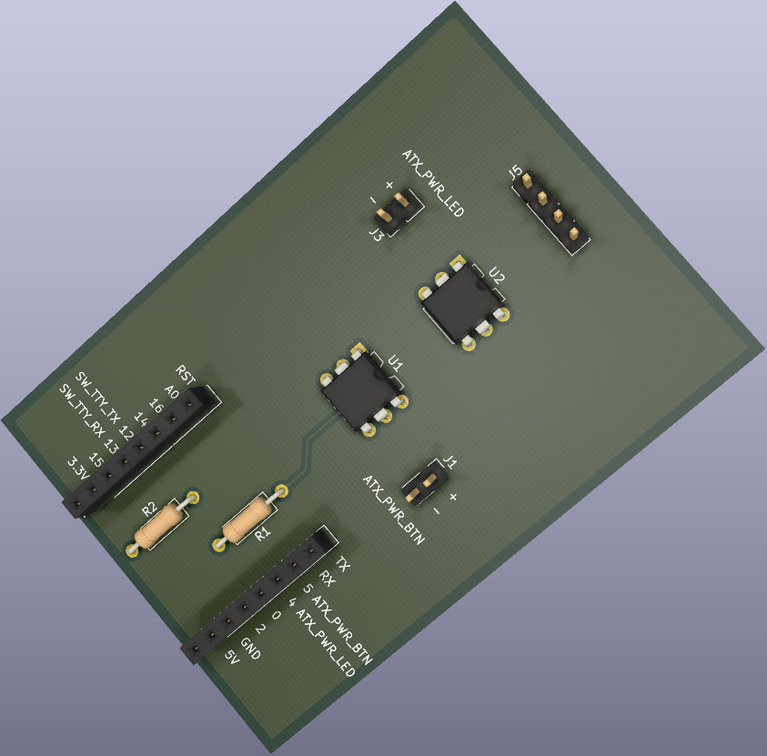

# Fence (Poor man's IPMI)

This is the implementation of an IPMI based on ESP6266 WeMos D1 Mini board.
The main requirement is to be cheap.

# Hardware

Here is the list of components:

0. 1 WeMos D1 mini
0. 1 Resistor 220 ohm
0. 1 Resistor 10k ohm
0. 2 4n25 optocoupler
0. 2 1x2 male pin header
0. 1 1x4 male pin header
0. 2 1x8 female pin header
0. 1 Fence board

This is an example of the board needed to have the functionality:

Front view

Back view

The `hw` directory contains the hardware board design file written using kicad.

# Software

The software is a simple Arduino schetch.

Required libraries for build it:

* ESP8266WebServer (https://github.com/codemee/ESP8266WebServer)
* SoftwareSerial (https://github.com/plerup/espsoftwareserial)
* WebSockets (https://github.com/Links2004/arduinoWebSockets)

## Note

HTML pages are gzipped binary blobs included statically as a char array.
To generate them, please execute the `build_header.sh` script before
compiling the schetch using the Arduino ide.

# Known issues

The Wemos D1 mini has the hardware serial used by the USB2Serial device.
For this reason it can not be used to link the controlled device.
To have the serial monitor feature, a software serial is used.
Apparently it can not exceed the 38400 bps, and at that speed, 
sopradic transmission errors can occur.

